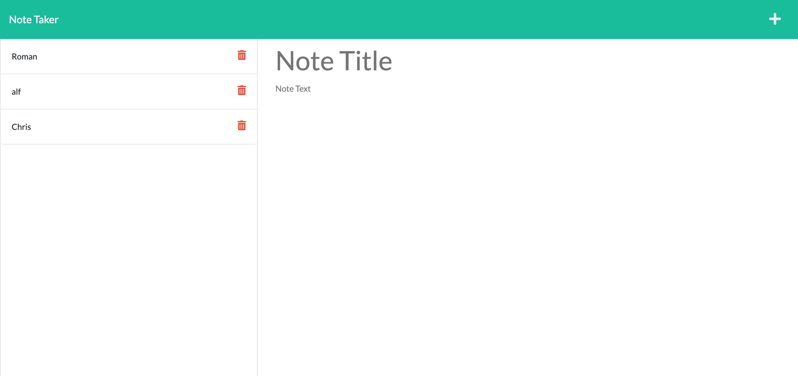

# <Note-Taker.>

# Mission
    * to modify the starter code to create an application note taker, that can be used to take notes and save them
    * the application should use express.js back end and retrieve data from a JSON file
    * to feature dynamically updated HTML & CSS
    * have a clean, polished and responsive user interface

# Parameters
    
    Given the command line applciation which takes the user input;

    * given a note-taking application when i open the note taker,
        user is presented with a landing page
    * when the user clicks on the link to the notes page,
        then he/she is presented with a page with existing notes listed in the left-hand column plus empty fields to enter a new note title and the note's text in the right-hand column
    * when user enters a new note title and the note's text ,
        then a save icon appears in the navigation at the top of the page
    * when clicked on the save button,
        then the new note user has entered is saved and appears in the left-hand column with the other existing notes
    * when clicked on the existing note in the list,
        then the note appears in the right hand colimn
    * when clicked on the write icon on the navigation on the top,
        then user is presented with empty fields to enter the new note title and note text
    

# Link to the GITHUB page

https://github.com/roman-ac/note-taker-by-roman-ac

# Screenshot

   